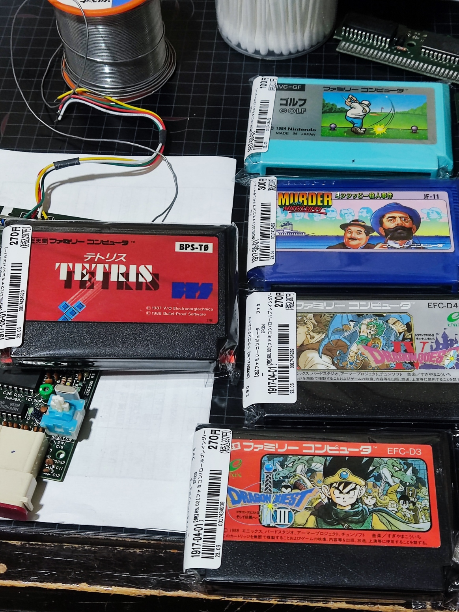
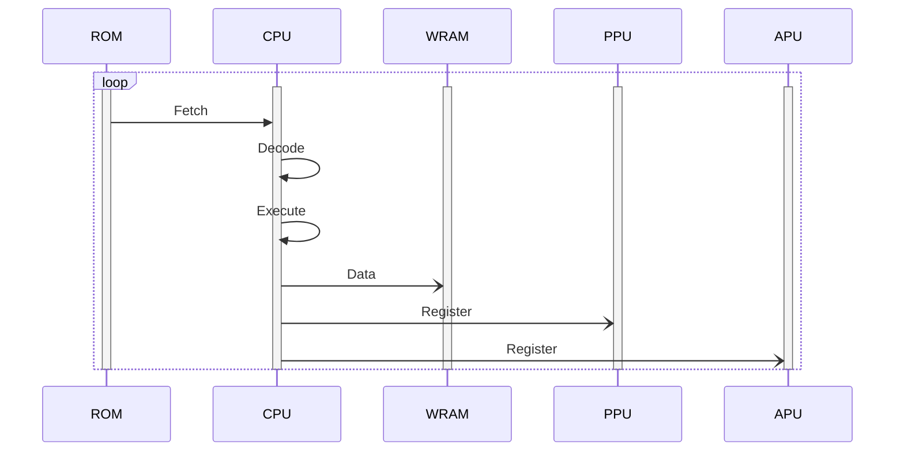
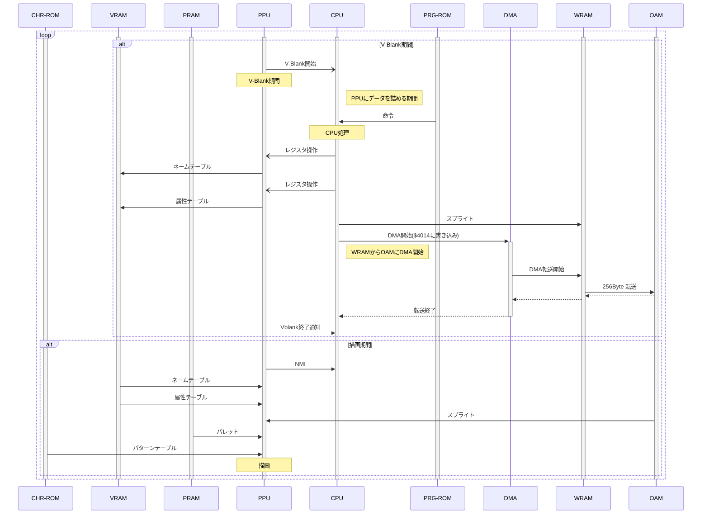
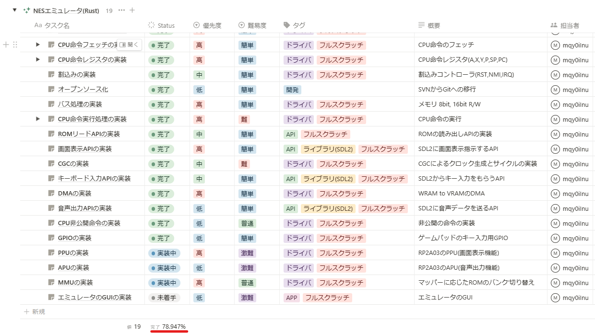
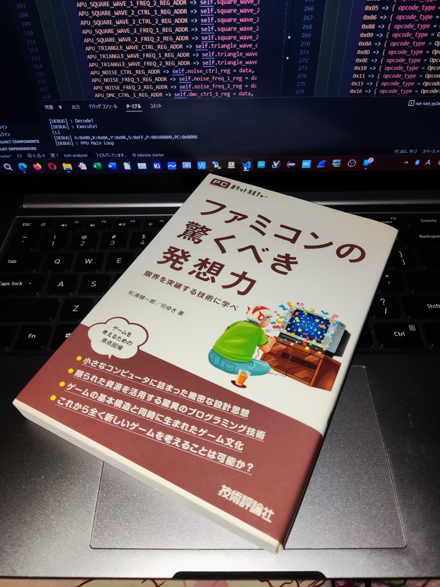

# 📍Rust NES Emulator (made in Japan🎌🍣)
This repository is making a NES emulator as a Rust study 😉😁😃.   
  
(`Rustの勉強`で`『習うより慣れろ』`でファミコンをエミュレータ作成中　(≧▽≦) /  
※ マイコン畑なC/C++の組み込み屋さんのRust奮闘記でもあるwww)  

# 📍Develop
I purchased a `🤑$4 NES🤑` and`🤑$2 NES Soft🤑`.  
I am developing an emulator based on them! (I even took it apart and analyzed it)  

# 📍Emulator Structure (Design)
# 📍CPU
- Freq = $\frac{21.47727\ \text{MHz}}{12} = 1.7897725\ \text{MHz}$  
  -

- T = $\frac{1}{5.3693175\ \text{MHz}} = 558.7302296800292 \ \text{nsec}$  
  -

# 📍PPU
- Freq = $\frac{21.47727\ \text{MHz}}{4} = 5.3693175\ \text{MHz}$  
  -
- T = $\frac{1}{5.3693175\ \text{MHz}} = 186.2434098933431 \ \text{nsec}$  
  -
   

# 📍PJ Status / PJ進捗状況📊
## `PJ Status / 進捗率` ... `📊63.158%📊`  
`Sorry for Japanese 🙇`  

# 📍Reference
下記に参考文献を示す。

## 📍Book Reference🎓📘📖

`👇This is my NES Bible 🤣👼👼‼`  
>PCポケットカルチャーシリーズ ファミコンの驚くべき発想力 -限界を突破する技術に学べ  
[About]💰💸🤑 -> : https://gihyo.jp/book/2010/978-4-7741-4429-0
  

## NES Reference🎓📘📖
### CPU
https://www.nesdev.org/wiki/NES_reference_guide  
https://www.nesdev.org/obelisk-6502-guide/reference.html  
https://pgate1.at-ninja.jp/NES_on_FPGA/  
https://github.com/suzukiplan/mgp-fc
  
### PPU
[English]  
https://www.nesdev.org/wiki/PPU  
http://www.dustmop.io/blog/2015/04/28/nes-graphics-part-1/  
http://www.dustmop.io/blog/2015/06/08/nes-graphics-part-2/  
http://www.dustmop.io/blog/2015/12/18/nes-graphics-part-3/  

[Japanese🎌]  
https://postd.cc/nes-graphics-part-1/  

### Mapper
https://www.nesdev.org/wiki/Mapper
http://pasofami.game.coocan.jp/nesalltitlelst.htm  
  
### iNES
https://www.nesdev.org/wiki/INES  
  
### Emulator
https://bugzmanov.github.io/nes_ebook/index.html  
  
## Rust Reference🎓📘📖
[English]  
https://doc.rust-jp.rs/book-ja/  
https://doc.rust-jp.rs/  
https://doc.rust-jp.rs/rust-by-example-ja/  
https://doc.rust-lang.org/stable/std/index.html  
  
[Japanese🎌]  
https://learn.microsoft.com/ja-jp/training/modules/rust-introduction/2-rust-overview  
https://sinkuu.github.io/api-guidelines/naming.html  
https://makandat.wordpress.com/2022/02/05/rust-%E3%81%AE%E5%8B%89%E5%BC%B7-snake-case-name/  
https://zenn.dev/mebiusbox/books/22d4c1ed9b0003/viewer/6d5875  
https://zenn.dev/tfutada/articles/16766e3b4560db  
https://zenn.dev/hankei6km/articles/using-jemalloc-in-rust-speeds-up-parallelism  
https://zenn.dev/khale/articles/rust-beginners-catchup  
https://qiita.com/yoshii0110/items/6d70323f01fefcf09682  
  
## Emmbed Rust Reference🎓📘📖
https://tomoyuki-nakabayashi.github.io/book/intro/index.html  
https://qiita.com/ochaochaocha3/items/1969d76debd6d3b42269  
https://lab.seeed.co.jp/entry/2021/04/30/180000  
  
## How to Development Env / 🎓📘📖
https://qiita.com/yannori/items/189cc0dbce2b81b9d1e1  
https://zenn.dev/watarukura/articles/20220304-8nefpx6tlmhxgbpvqwah2gzoff  
https://zenn.dev/fah_72946_engr/articles/cf53487d3cc5fc  