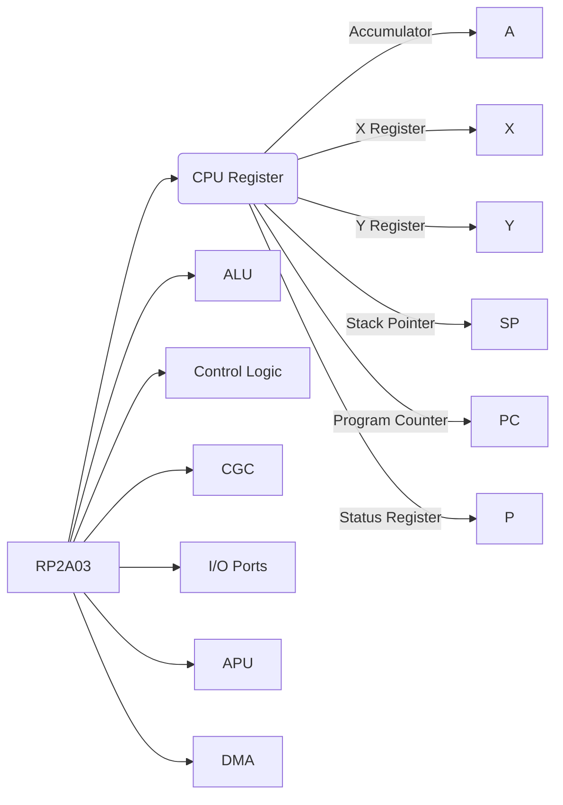

# PJ進捗
`進捗率` ... `18.75%`  

# エミュレータの構成
- NES
  - WRAM
  - PPU
    - VARM
    - 音声出力
  - RP2A03
    - CPU
        - 命令デコーダ
        - ALU
        - CPUレジスタ
            - アキュムレータ(汎用レジスタ)
            - インデックスレジスタ X
            - インデックスレジスタ X
            - ステータスレジスタ
            - SP
            - PC
      - 割り込みコントローラ
        - RST
        - NMI
        - IRQ
      - バスコントローラ
      - GCG(クロックジェネレータ)
      - DMA
      - APU
      - GPIO
      - タイマー(タイミングコントローラ)

# オペコード一覧

下のURLの赤色の命令までみた  
https://www.nesdev.org/wiki/CPU_unofficial_opcodes  
STX STY BIT CPX CPY LDY BRK JSR STP NOP BVS PHP PLP PHA PLA  
DEY TAY INY INX JMP BPL BMI BVC BCC BCS BNE BEQ CLC SEC CLI  
SEI TYA CLV CLD SED

# アドレッシングモード
RP2A03のアドレッシングモード

`ゼロページアドレッシング（Zero Page addressing）`:
- アドレス範囲: $0000-$00FF（0-255）
- メモリの最初の256バイトにアクセスします。
- 例: LDA $00

`絶対アドレッシング（Absolute addressing）`:
- アドレス範囲: $0000-$FFFF（0-65535）
- メモリ全体にアクセスします。
- 例: LDA $2000

`相対アドレッシング（Relative addressing）`:
- アドレス範囲: -128から+127
- 相対的なジャンプや分岐に使用されます。
- 例: BNE $10

`間接アドレッシング（Indirect addressing）`:
- アドレス範囲: $0000-$FFFF（0-65535）
- メモリ上のアドレスから間接的にデータを読み取ります。
- 例: JMP ($2000)

# テスト
## 単体テスト
- `LDA`
    - Test OK(2023/6/4)　※Immediate(即値)でテスト

- `SEC` `SED` `SEI` `CLC` `CLD` `CLI` `CLV`
    - Test OK(2023/6/4)

- `TAX` `TAY` `TXA` `TYA`
    - Test OK(2023/6/4)

- `TSX` `TXS` `PHA` `PHP` `PLA` `PLP`
    - 実装のみ(2023/6/4)

- `BRK` `BIT`
    - 実装のみ(2023/6/4)

- `AND` `ORA` `EOR`
    - Test OK(2023/6/4)　※全部Immediate(即値)でテスト

- `ADC` `SBC` `CMP` `CPX` `CPY` `INC` `INX` `INY` `DEC` `DEX` `DEY`
    - 実装のみ(2023/6/5)

- `LDX` `LDY` `STA` `STX` `STY`
    - 実装のみ(2023/6/5)

`ASL` `LSR` `ROL` `ROR`
    - 実装のみ(2023/6/5)

`JMP`
    - Test OK(2023/6/5)

`JSR`
    - 実装のみ(2023/6/5)

`BCC` `BCS` `BNE` `BEQ` `BPL` `BMI` `BVC` `BVS`
    - 実装のみ(2023/6/5)

# RSiComE
`RuSCom` ... Rust Famicom Emulator  
`RuSSRCom` ... Rust Super Famicom Emulator  
`RuSD` ... Rust DMG(GC) Emulator   
`RuSA` ... Rust AGB(GBA) Emulator

# エミュレータ ブロック図

# 参考文献
下記に参考文献を示す。

## Rust リファレンス(公式)
https://doc.rust-jp.rs/book-ja/
https://doc.rust-jp.rs/
https://doc.rust-jp.rs/rust-by-example-ja/
https://doc.rust-lang.org/stable/std/index.html

## Rust リファレンス(Microsoft)
https://learn.microsoft.com/ja-jp/training/modules/rust-introduction/2-rust-overview

## Rust リファレンス(有志)
https://sinkuu.github.io/api-guidelines/naming.html
https://makandat.wordpress.com/2022/02/05/rust-%E3%81%AE%E5%8B%89%E5%BC%B7-snake-case-name/
https://zenn.dev/mebiusbox/books/22d4c1ed9b0003/viewer/6d5875
https://zenn.dev/tfutada/articles/16766e3b4560db
https://zenn.dev/hankei6km/articles/using-jemalloc-in-rust-speeds-up-parallelism
https://zenn.dev/khale/articles/rust-beginners-catchup
https://qiita.com/yoshii0110/items/6d70323f01fefcf09682

## Rustによるエミュレータの実装
https://bugzmanov.github.io/nes_ebook/chapter_3_2.html
https://zenn.dev/razokulover/articles/1191ca55f9f22e

## 組み込みRust リファレンス(有志) 
https://tomoyuki-nakabayashi.github.io/book/intro/index.html
https://qiita.com/ochaochaocha3/items/1969d76debd6d3b42269
https://lab.seeed.co.jp/entry/2021/04/30/180000

## 環境構築
https://qiita.com/yannori/items/189cc0dbce2b81b9d1e1
https://zenn.dev/watarukura/articles/20220304-8nefpx6tlmhxgbpvqwah2gzoff
https://zenn.dev/fah_72946_engr/articles/cf53487d3cc5fc